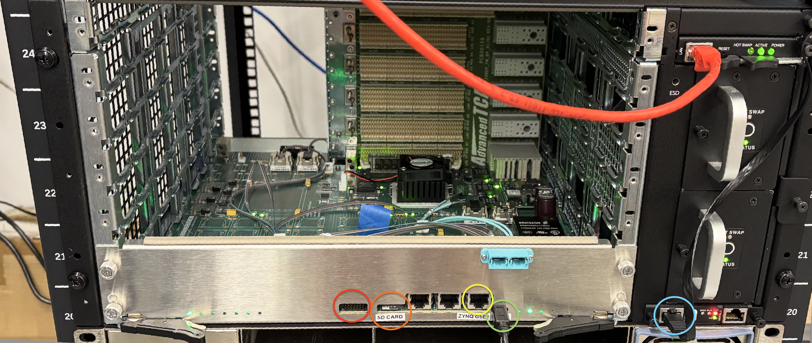

# Physical Hardware Setup

The gFEX board complies to the [ATCA board](https://en.wikipedia.org/wiki/Advanced_Telecommunications_Computing_Architecture) standard. Thus, we can have it inside an ATCA shelf. The shelf holds the board and manages power delivery, as well as running a shelf manager program that can be accessed by a serial connection. Through serial, we can remotely send commands to connect and disconnect power to the board. We can see the physical setup in the following image with one of the prototype v4 boards:

I have highlighted the relevant connections to both the board and the shelf with colored circles:

- **Red Circle**: a JTAG connection to the FPGA on the board. This allows FPGA programming access using Vivado's hardware manager.
- **Orange Circle**: a microSD card slot on the board. This is where the OS the SoC boots from should be located.
- **Yellow Circle**: the ethernet connection to the SoC on the board.
- **Green Circle**: a USB serial connection to the SoC on the board. It contains the interface to the OS as soon as it starts booting, accessible with the `minicom` command.
- **Blue Circle**: the USB serial connection to the ATCA shelf. It contains the interface to the shelf commands, and is also accessible with the `minicom` command.

Please handle both the board and shelf with care, as they are delicate and heavy.

### Previous article: [Useful Linux Commands](4-Useful-Linux-Commands.md)
### Home: [Documentation Overview](README.md)
### Next article: [Useful ATCA Commands](6-Useful-ATCA-Commands.md)