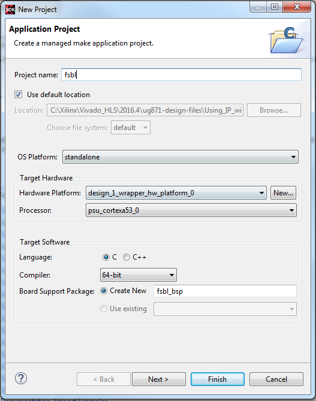
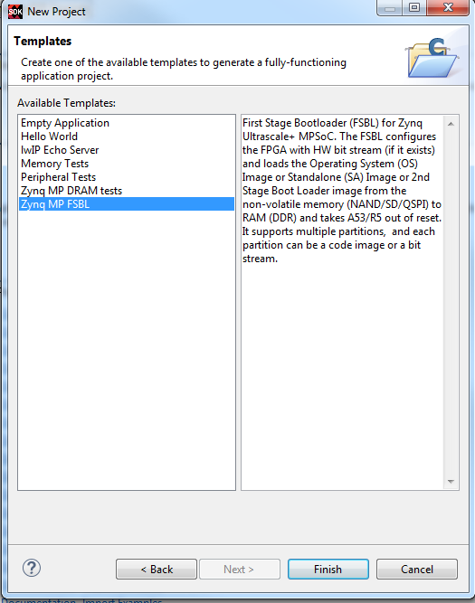
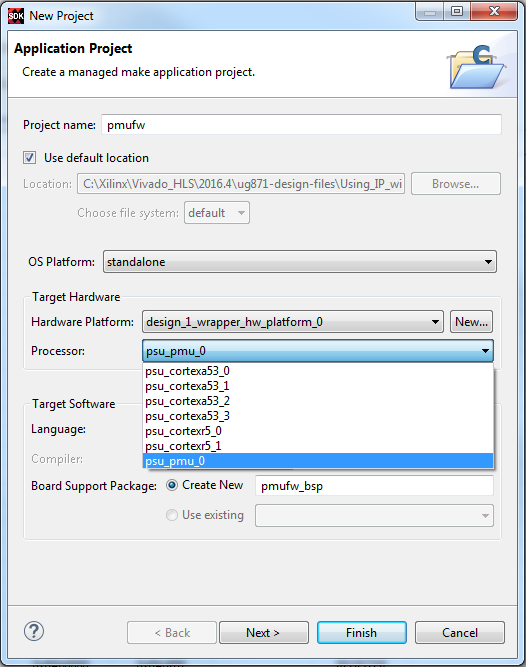
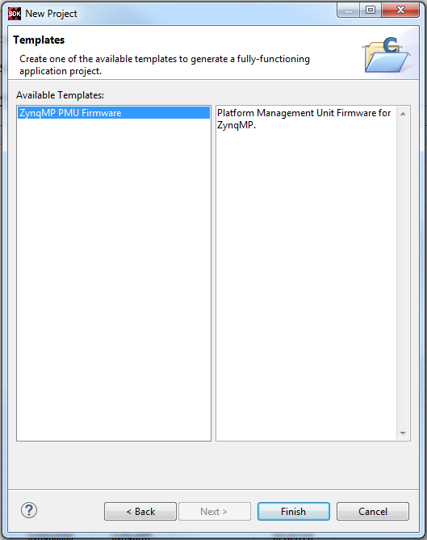
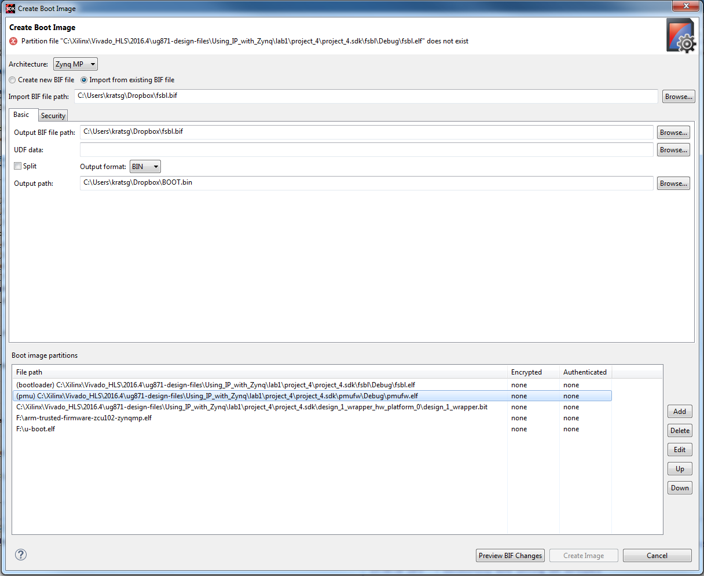

<!-- START doctoc generated TOC please keep comment here to allow auto update -->
<!-- DON'T EDIT THIS SECTION, INSTEAD RE-RUN doctoc TO UPDATE -->
**Table of Contents**  *generated with [DocToc](https://github.com/thlorenz/doctoc)*

- [FSBL Method](#fsbl-method)
  - [Files Required](#files-required)
    - [Bitstream and Device Tree](#bitstream-and-device-tree)
    - [Filesystem](#filesystem)
    - [ARM Trusted Firmware](#arm-trusted-firmware)
    - [Exception Levels](#exception-levels)
  - [bitbake execution](#bitbake-execution)
  - [Xilinx SDK Generations](#xilinx-sdk-generations)
    - [Create the FSBL](#create-the-fsbl)
    - [Create the PMUFW](#create-the-pmufw)
    - [Create the BOOT image](#create-the-boot-image)
  - [Preparing the bootscript](#preparing-the-bootscript)
  - [Preparing the SD Card](#preparing-the-sd-card)
    - [Identify SD Card](#identify-sd-card)
    - [Erase the first few bytes](#erase-the-first-few-bytes)
    - [Configure the sectors, heads, and cylinders](#configure-the-sectors-heads-and-cylinders)
      - [Calculate new_cylinders](#calculate-new_cylinders)
    - [Create actual partitions](#create-actual-partitions)
    - [Creating filesystems on new partitions](#creating-filesystems-on-new-partitions)
    - [Copying Files Over](#copying-files-over)
  - [Booting the Zynq MPSoC Ultrascale+](#booting-the-zynq-mpsoc-ultrascale)
- [Useful Links](#useful-links)

<!-- END doctoc generated TOC please keep comment here to allow auto update -->

There are two main ways that you can boot the board using an SD Card. The way that I've been able to get working for the Zynq Ultrascale+ MPSoc "Zynq+" is via the Xilinx SDK bootgen and First Stage Boot loader (FSBL). Another possibility is through the Secondary Program Loader (SPL) but this method has various problems preventing it from working right now. This guide will focus only on the FSBL method and the general steps needed to get this working. All of this was tested on 2016.4.

Many thanks to [this guide by Matteo](https://www.starwaredesign.com/index.php/articles-and-talks/87-build-and-deploy-yocto-linux-on-the-xilinx-zynq-ultrascale-mpsoc-zcu102) for inspiration and help and quick response to emails.

# FSBL Method

The general steps are highlighted below:

1. [Generate your device tree](http://www.wiki.xilinx.com/Build+Device+Tree+Blob) (if not using the evaluation board) from Vivado
1. Build your kernel image (also provides a uImage and u-boot binary) using [bitbake](https://en.wikipedia.org/wiki/BitBake)
  - Build your ARM Trusted Firmware (ATF) if not built automatically with your image: `bitbake arm-trusted-firmware`
1. Use Vivado to generate the Power Management Unit Firmware (PMUFW)
1. Use Vivado to generate the FSBL firmware
1. Use Vivado/bootgen to create a bootimage (BOOT.bin)
1. Prepare your SD card [ref](http://www.wiki.xilinx.com/Prepare+Boot+Medium)
1. Copy all necessary files to an SD card with a FAT32 BOOT partition and an ext4 ROOT partition.

## Files Required

The following files are required in order to get everything working.

| Originating | File Name                | Partition | Description                                                           |
|-------------|--------------------------|-----------|------------------------------------------------------------------------
  Xilinx SDK  | BOOT.BIN                 | BOOT (1)  | bootgen image containing the bitstream and binaries: FSBL, U-Boot, ATF, PMUFW
  bitbake     | system.dtb               | BOOT (1)  | Device tree binary blob used by Linux, loaded into memory by U-Boot
  bitbake     | Image                    | BOOT (1)  | Linux kernel image, loaded into memory by U-Boot
  by hand     | uEnv.txt                 | BOOT (1)  | An editable bootscript defining the boot configuration [ref](http://linux-sunxi.org/UEnv.txt)
  bitbake     | zcu102-zynqmp.tar.gz     | ROOT (2)  | Ramdisk image used by Linux, loaded into memory by U-Boot
  Xilinx SDK  | top.bit                  | --------- | bitstream file that will be used to create a hardware definitions file (HDF)
  Xilinx SDK  | fsbl.elf                 | --------- | FSBL elf image used to create BOOT.BIN image
  Xilinx SDK  | pmufw.elf                | --------- | Handles the initial stage of the boot, stays running to do power monitoring/management
  Xilinx SDK  | boot.bif                 | --------- | Defines the BOOT.bin that gets created with bootgen, needs to be edited for exception levels
  bitbake     | u-boot.elf               | --------- | U-Boot elf file used to create the BOOT.BIN image
  bitbake     | arm-trusted-firmware.elf | --------- | Equivalent of ARM TrustZone monitor for Cortex-A at 32-bit

### Bitstream and Device Tree

If you use the default compiled device tree provided by `meta-xilinx` using the `zcu102-zynqmp` machine, this will be compatible with a block design containing only the Zynq MPSoC processor IPCore (with the PS-PL clocks disabled). Otherwise, you will need to create your own machine and this is out of the scope of this particular tutorial.

### Filesystem

There's a couple of ways to load the filesystem depending on which you use, such as CPIO extraction (treating it as a ramdisk) or untarring into the second partition of the SD card. For the purposes of the tutorial, I'll focus on untarring into the second partition, so you should look for bitbake-produced files that have `tar.gz` in their extension.

### ARM Trusted Firmware

ATF is the ARM Trusted Firmware and it is the equivalent of the ARM TrustZone monitor for Cortex-A at 32 bit. It basically manages the access to the secure world from the non-secure world. Being i.e. non-secure world Linux and secure world where the encryption keys are store.

### Exception Levels

I haven't looked into this in detail. This will need to be added manually to avoid system crashing after the FSBL handoff, see https://forums.xilinx.com/t5/Embedded-Linux/2016-3-ZynqMP-zcu102-Wrong-exception-level-in-ATF-BL31-after/td-p/730428 for an example.

## bitbake execution

This step should be done with one or two commands:

```
bitbake <image-name>
```

and if that doesn't produce your ARM Trusted Firmware file, you will need to run

```
bitbake arm-trusted-firmware
```

which will produce the ELF in the same `deploy/images` directory as the above. An example image you might want to try is `zynq-base`. All your files will be found in `tmp/deploy/images/<machine-name>/`. This completes the first step. See [[Building-and-Deploying-an-OS]] for more details.

## Xilinx SDK Generations

### Create the FSBL

Open up the Xilinx SDK with the HDF (hardware description file) and BIT (bitstream file) loaded. From here, you will first create an application project for the Zynq Ultrascale+ MPSoC FSBL `File > New > Application Project`:



and then select the Zynq+ FSBL project



and then the SDK will automatically build the necessary files, including the `fsbl.elf` file and copy over the bitstream file. The `fsbl.elf` file and the bitstream file will most likely be found in the `Debug/` folder under that project. This completes the first step.

### Create the PMUFW

Follow the same steps above, but this time, target the `PMU` instead of the `PS`. This might take a few seconds for Xilinx to load some other stuff



then there is only one example project which is the PMU firmware



and then SDK will automatically build the necessary files, include the `pmufw.elf` file. The `pmufw.elf` file will most likely be found in the `Debug/` folder under that project. This completes the second step.

### Create the BOOT image

Now, we just need to create the boot image `BOOT.BIN` with the necessary files loaded in the correct order. From the Xilinx SDK, `Xilinx Tools > Create Boot Image` which brings up a dialog



where we need to have the following files loaded in exactly this order and type

| File Type             | File Name                                  | Destination |
------------------------|--------------------------------------------|-------------|
 bootloader             | /path/to/sdk/fsbl_project/Debug/fsbl.elf   | PL
 pmufw                  | /path/to/sdk/pmufw_project/Debug/pmufw.elf | PMU
 datafile               | /path/to/sdk/hardware_project/top.bit      | PL
 datafile               | /path/to/bitbake/files/atf.elf             | PS (a53-0, EL-3, TrustZone)
 datafile               | /path/to/bitbake/files/u-boot.elf          | PS (a53-0, EL-2)

and then we can go ahead and `Create Image`. This will be created in the path you specify. If you open up the created `.bif` file, you should see something like

```
//arch = zynqmp; split = false; format = BIN
the_ROM_image:
{
        [fsbl_config]a53_x64
        [bootloader, destination_device = pl]C:\Xilinx\Vivado_HLS\2016.4\ug871-design-files\Using_IP_with_Zynq\lab1\project_4\project_4.sdk\fsbl\Debug\fsbl.elf
        [pmufw_image]C:\Xilinx\Vivado_HLS\2016.4\ug871-design-files\Using_IP_with_Zynq\lab1\project_4\project_4.sdk\pmufw\Debug\pmufw.elf
        [destination_device = pl]C:\Xilinx\Vivado_HLS\2016.4\ug871-design-files\Using_IP_with_Zynq\lab1\project_4\project_4.sdk\design_1_wrapper_hw_platform_0\design_1_wrapper.bit
        [destination_cpu = a53-0]F:\arm-trusted-firmware-zcu102-zynqmp.elf
        [destination_cpu = a53-0]F:\u-boot.elf
}
```

If you continue and try to boot the board and you get a [system crash](https://forums.xilinx.com/t5/Embedded-Linux/2016-3-ZynqMP-zcu102-Wrong-exception-level-in-ATF-BL31-after/td-p/730428) or the ATF hangs and doesn't hand-off to u-boot, it may be because `u-boot` needs an exception level (raised security). In this case, you will need to add `exception_level=el-3` and `exception_level=el-2` so that your `.bif` looks like

```
//arch = zynqmp; split = false; format = BIN
the_ROM_image:
{
        [fsbl_config]a53_x64
        [bootloader, destination_device = pl]C:\Xilinx\Vivado_HLS\2016.4\ug871-design-files\Using_IP_with_Zynq\lab1\project_4\project_4.sdk\fsbl\Debug\fsbl.elf
        [pmufw_image]C:\Xilinx\Vivado_HLS\2016.4\ug871-design-files\Using_IP_with_Zynq\lab1\project_4\project_4.sdk\pmufw\Debug\pmufw.elf
        [destination_device = pl]C:\Xilinx\Vivado_HLS\2016.4\ug871-design-files\Using_IP_with_Zynq\lab1\project_4\project_4.sdk\design_1_wrapper_hw_platform_0\design_1_wrapper.bit
        [destination_cpu = a53-0, exception_level = el-3]F:\arm-trusted-firmware-zcu102-zynqmp.elf
        [destination_cpu = a53-0, exception_level = el-2]F:\u-boot.elf
}
```

## Preparing the bootscript

The bootscript is an editable text file that defines how to boot the board correctly and these parameters can be read in via `u-boot` for example. Instead of discussing what you should do, I've provided an example `uEnv.txt` below tha you should probably copy as part of this tutorial

```bash
kernel_image=Image
devicetree_image=system.dtb
dtb=system.dtb
bootargs=earlycon=cdns,mmio,0xFF000000,115200n8 root=/dev/mmcblk0p2 rw rootwait cma=128M
uenvcmd=fatload mmc 0 0x3000000 ${kernel_image} && fatload mmc 0 0x2A00000 ${devicetree_image} && bootm 0x3000000 - 0x2A00000
```

A few of the options are generally self-explanatory. In particular, you should notice that the `root=/dev/mmcblk0p2` command is letting `u-boot` know where to find the filesystem you will be extracting in to the second partition of the SD card. Before, with the Zynq 7-series, it seemed possible to specify `devicetree_image=devicetree.dtb` but this didn't seem to get recognized with `u-boot` for the Zynq MPSoC. The default it expects is `system.dtb`. Similar issue came up with the kernel image `uImage` to `Image`.

## Preparing the SD Card

I usually bypass all this SD Card fdisk fiddling by just using gparted. Make a "BOOT" partition, FAT32, 64MB, starting at zero. Then make a "rootfs" partition, ext4, rest of card.

You need to prepare the SD card with two partitions: a FAT32 BOOT partition and an ext4 ROOT partition. These partition need to contain the [files required](#files-required). The next step will explain how to copy these over. Referring to the [Xilinx wiki](http://www.wiki.xilinx.com/Prepare+Boot+Medium) on preparing the SD card correctly with partitions, I will re-iterate the steps here in case the wiki changes in the future.

Note: these steps are strongly recommended to be performed on a Linux machine with `fdisk`, `dmesg`, and `partprobe` along with administrator privileges.

### Identify SD Card

Plug in the SD card into the Linux machine and identify which device file maps to it, via `dmesg | tail` which will show something like

```
[76893.874830] sd 6:0:0:2: [sde] 30318592 512-byte logical blocks: (15.5 GB/14.4 GiB)
[76893.879866]  sde: sde1 sde2
```

This is telling you that your SD card is identified by `sde` which means `/dev/sde` is the device file mapping to the SD card. For the purposes of this tutorial, I will refer to it as `/dev/sdX` but please replace it with your version where necessary.

### Erase the first few bytes

*Is this necessary?*

```bash
dd if=/dev/zero of=/dev/sdX bs=1024 count=1
```

According to Xilinx, the `fdisk` utility does not seem to erase the first few bytes of the first sector in the card when the partition table is saved. So you will use `dd` (affectionality known as `disk destroyer` to erase the first sector).

### Configure the sectors, heads, and cylinders

*Is this necessary?*

#### Calculate new_cylinders

To calculate the new cylinders value, we run

```bash
fdisk -l /dev/sdX
```

which gives an output like

```bash
Disk /dev/sde: 8068 MB, 8068792320 bytes
249 heads, 62 sectors/track, 1020 cylinders, total 15759360 sectors
Units = sectors of 1 * 512 = 512 bytes
Sector size (logical/physical): 512 bytes / 512 bytes
I/O size (minimum/optimal): 512 bytes / 512 bytes
Disk identifier: 0x00000000

Disk /dev/sde doesn't contain a valid partition table
```

Look for the size of the device in bytes `8068792320 bytes` and calculate with the following formula `new_cylinders = <size> / 8225280`. In this example, we would calculate `new_cylinders = 980`.

Now, let's use `fdisk` to enter and partition the card

```bash
fdisk /dev/sdX
```

If you type `p`, you should not see any partitions on the SD card. Next, enter `expert mode` with `x` and then configure the sectors, heads, and cylinders of the SD card

```bash
Command (m for help): x
Expert command (m for help): h
Number of heads (1-256, default 30): 255
Expert command (m for help): s
Number of sectors (1-63, default 29): 63
Expert command (m for help): c
Number of cylinders (1-1048576, default 2286): <new_cylinders calculated from above>
Command (m for help): r
```

### Create actual partitions

*Note*: If you did not configure the sectors, heads, and cylinders of the SD card, start with `fdisk /dev/sdX`.

Now the actual partitions can be created. For the first partition (which will be our BOOT), I suggest at least 200M as the generated `BOOT.bin` can be rather large and needs to fit comfortably here

```bash
Command (m for help): n
Partition type:
 p primary (0 primary, 0 extended, 4 free)
 e extended
Select (default p): p
Partition number (1-4, default 1): 1
First sector (2048-15759359, default 2048):
Using default value 2048
Last sector, +sectors or +size{K,M,G} (2048-15759359, default 15759359): +200M
```

and now do the same procedure for the second partition (which will hold our ROOT filesystem)

```bash
Command (m for help): n
Partition type:
 p primary (1 primary, 0 extended, 3 free)
 e extended
Select (default p): p
Partition number (1-4, default 2): 2
First sector (411648-15759359, default 411648):
Using default value 411648
Last sector, +sectors or +size{K,M,G} (411648-15759359, default 15759359):
Using default value 15759359
```

The next thing we need to do is set the bootable flag

```bash
Command (m for help): a
Partition number (1-4): 1
```

and then the partition types

```bash
Command (m for help): t
Partition number (1-4): 1
Hex code (type L to list codes): c
Changed system type of partition 1 to c (W95 FAT32 (LBA))
Command (m for help): t
Partition number (1-4): 2
Hex code (type L to list codes): 83
```

and finally, we can check the new partition table to make sure the changes look right

```bash
Command (m for help): p

Disk /dev/sdb: 8068 MB, 8068792320 bytes
249 heads, 62 sectors/track, 1020 cylinders, total 15759360 sectors
Units = sectors of 1 * 512 = 512 bytes
Sector size (logical/physical): 512 bytes / 512 bytes
I/O size (minimum/optimal): 512 bytes / 512 bytes
Disk identifier: 0x920c958b

 Device Boot Start End Blocks Id System
/dev/sdb1 * 2048 411647 204800 c W95 FAT32 (LBA)
/dev/sdb2 411648 15759359 7673856 83 Linux
 ```

and then write the partition table to disk

```bash
Command (m for help): w
The partition table has been altered!

Calling ioctl() to re-read partition table.

WARNING: If you have created or modified any DOS 6.x
partitions, please see the fdisk manual page for additional
information.
Syncing disks.
```

which should hopefully go off without a hitch. If there's a syncing problem, try

```bash
partprobe /dev/sdX
```

and if that still doesn't work, you might try [turning it off and on again](https://www.youtube.com/watch?v=rksCTVFtjM4) and seeing if the kernel syncs the changes. If it still doesn't, try a different SD card.

### Creating filesystems on new partitions

Next, is the easiest of all the steps here. Our BOOT partition will be a FAT32 filesystem (makes it easy to copy files onto it from Windows/Mac/Linux) and our ROOT will be EXT4.

```bash
mkfs.vfat -F 32 -n BOOT /dev/sdX1
mkfs.ext4 -L ROOT /dev/sdX2
```

Note that the numbers at the end refer to the first or second partition. If you're unsure of what these are, run `fdisk -l /dev/sdX` to double-check.

### Copying Files Over

First, you should go ahead and mount the ROOT partition to untar your filesystem:

```bash
mkdir -p /media/ROOT
mount /dev/sdX2 /media/ROOT
```

then to untar, an example command is provided to give you an idea of what this would look like

```bash
cd /media/BOOT
tar -xzvf ~/d4/poky/build/tmp/deploy/images/zcu102-zynqmp/zynq-base-zcu102-zynqmp.tar.gz
```

finally, unmount the `ROOT` partition with (`umount` and not `unmount`!)

```bash
umount /media/ROOT
```

For the `BOOT` partition, just copy over the files normally. You can choose to mount it similarly

```bash
mkdir -p /media/BOOT
mount /dev/sdX1 /media/BOOT
cp BOOT.bin /media/BOOT
cp system.dtb /media/BOOT
cp Image /media/BOOT
cp uEnv.txt /media/BOOT
umount /media/BOOT
```

or just plug it in a machine and drag-drop the files as the `BOOT` partition should just be auto-mounted as a storage device.

## Booting the Zynq MPSoC Ultrascale+

Configure SW16(?) to `0xE` (according to [this forum post](https://forums.xilinx.com/t5/Xilinx-Boards-and-Kits/ZCU102-fail-to-boot-from-SD-card/m-p/739836#M14443) if you have a rev1.0 board with ES2 chip)

[](https://www.starwaredesign.com/index.php/articles-and-talks/87-build-and-deploy-yocto-linux-on-the-xilinx-zynq-ultrascale-mpsoc-zcu102)

and then plug in the SD card and you should see the board boot up successfully. Refer to [this Xilinx wiki](http://www.wiki.xilinx.com/Setup+a+Serial+Console) on setting up a serial console if you don't know how to do that.

# Useful Links

- https://forums.xilinx.com/t5/Embedded-Linux/ZCU102-Ultrascale-ATF-hangs-in-SDCard-boot-using-FSBL/td-p/757044
- https://www.starwaredesign.com/index.php/articles-and-talks/87-build-and-deploy-yocto-linux-on-the-xilinx-zynq-ultrascale-mpsoc-zcu102
- https://forums.xilinx.com/t5/Xilinx-Boards-and-Kits/ZCU102-fail-to-boot-from-SD-card/m-p/739836#M14443
- http://www.wiki.xilinx.com/Build+Device+Tree+Blob
- http://www.wiki.xilinx.com/Prepare+Boot+Medium
- http://linux-sunxi.org/UEnv.txt
